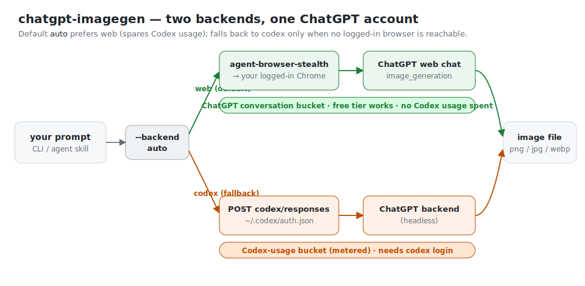

# chatgpt-imagegen

[](https://github.com/leeguooooo/chatgpt-imagegen/actions/workflows/ci.yml)

**English** | [中文](./README.zh-CN.md)

**Generate images using your ChatGPT subscription — no `OPENAI_API_KEY` needed.**

A tiny, zero-dependency Python CLI (and AI-agent skill) — one file, stdlib only — that generates images with your ChatGPT account, on the command line and for any AI agent.

> **✨ Works on a free ChatGPT account too.** The default `web` backend just drives the normal ChatGPT web chat, where **even free-tier users get image generation** — so no paid plan, no API key, and no Codex required (subject to the free tier's daily image limit). Paid plans simply get higher limits.

```bash
chatgpt-imagegen "a watercolor cat sitting on a windowsill" -o cat.png
# -> saved: cat.png  (812,344 bytes)  size=1024x1024  quality=medium
```


---

## Why this exists

OpenAI offers image generation in two completely separate ways:

| Path | What you pay | How |
| --- | --- | --- |
| **Direct API** (`/v1/images/generations`) | per-image, on top of an `OPENAI_API_KEY` | curl / OpenAI SDK / etc. |
| **ChatGPT subscription** (Plus / Pro / Team) | flat monthly fee | ChatGPT web/desktop app, or the Codex CLI's built-in `image_gen` |

The **subscription path is invisible** to people who don't use the Codex CLI. It runs on ChatGPT's internal `backend-api/codex/responses` endpoint as a Responses-API tool, authenticated by the OAuth token written into `~/.codex/auth.json` when you run `codex login`.

`chatgpt-imagegen` exposes that capability on the command line and to any AI agent — with **two backends** that hit different parts of your subscription.

## Backends



The same subscription meters two separate buckets, and which one you spend depends on *where* the image is generated:

| Backend | How it generates | Bucket spent | Needs |
| --- | --- | --- | --- |
| **`web`** | Drives your already-logged-in ChatGPT **browser** (via [`chrome-use`](https://github.com/leeguooooo/chrome-use), formerly `agent-browser-stealth`) and generates in a normal chat — the same surface as typing in the app. Its real-Chrome connect produces the **Cloudflare Turnstile** token a plain/headless client can't forge (CF's edge and the sentinel PoW are passable bare — Turnstile is the wall). Each run is filed under a ChatGPT **Project** (default `imagegen`) and the conversation is **deleted afterwards by default** (`--keep-conversation` to keep it), so it leaves no history. | **ChatGPT conversation** — does *not* touch your metered **Codex-usage** limit. | Any logged-in chatgpt.com browser (**free tier works**) + `chrome-use`. |
| **`codex`** | Headless POST to `backend-api/codex/responses`, reusing `~/.codex/auth.json`. | **Codex-usage** (the metered bucket). | `codex login`. |

**Default `auto`** tries `web` first (to spare Codex-usage) and falls back to `codex` when no logged-in browser is reachable. Force one with `--backend web` / `--backend codex` (or `CHATGPT_IMAGEGEN_BACKEND`).

- **Laptop / desktop** (Chrome open + signed in) → `web` — no Codex-usage spent.
- **Server / headless agent box** → `codex` — no browser there, so `auto` falls back on its own.

`web` generates under **whatever account that browser is logged into**, which may differ from `~/.codex/auth.json` — sign the browser into the account whose bucket you want.

## Install

You need Python 3.10+, a ChatGPT subscription, and **at least one backend** (`auto` uses whichever is set up, preferring `web`):

**`codex` backend** — `npm i -g @openai/codex` then `codex login` (writes `~/.codex/auth.json`).

**`web` backend** — [`chrome-use`](https://github.com/leeguooooo/chrome-use) (formerly `agent-browser-stealth`; it drives your real logged-in Chrome via an extension, which is what passes Cloudflare + ChatGPT's anti-bot check) connected to a Chrome signed in to chatgpt.com:

```bash
curl -fsSL https://raw.githubusercontent.com/leeguooooo/chrome-use/main/install.sh | sh
chrome-use extension install
# then: add the Chrome extension → restart Chrome → sign in to chatgpt.com
```

Extension: [Chrome Web Store](https://chromewebstore.google.com/detail/agent-browser-stealth/knfcmbamhjmaonkfnjhldjedeobeafmk). Older installs exposing the binary as `agent-browser` / `abs` keep working — the CLI accepts both names.

> No `chrome-use`? Nothing breaks and nothing gets installed behind your back: `auto` mode falls back to `codex` and prints a one-line tip that installing `chrome-use` makes generation cost no Codex-usage.

### Option A — for AI agents (recommended)

Install via [skills.sh](https://www.skills.sh) — works with Claude Code, Codex Agent, Cursor, OpenClaw, etc.:

```bash
npx skills add leeguooooo/chatgpt-imagegen -g
```

This drops both the agent instructions (`SKILL.md`) and the CLI itself into your agent's skill directory. Just ask any compatible agent: *"画一张 xxx"* / *"generate a hero banner for the README"*.

### Option B — standalone CLI

```bash
git clone https://github.com/leeguooooo/chatgpt-imagegen
cd chatgpt-imagegen
chmod +x chatgpt-imagegen
./chatgpt-imagegen "a tiny pixel-art mushroom"
```

Or put it on your `$PATH`:

```bash
sudo install chatgpt-imagegen /usr/local/bin/chatgpt-imagegen
```

That's the entire setup. No `pip install`, no virtualenv, no daemon.

## Usage

```bash
chatgpt-imagegen "<prompt>" [options]
```

| Flag | Default | Notes |
| --- | --- | --- |
| `--backend` | `auto` | `auto` \| `web` \| `codex`. `auto` prefers web (spares Codex-usage), falls back to codex if no logged-in browser. See [Backends](#backends). Also `CHATGPT_IMAGEGEN_BACKEND`. |
| `--profile` | `auto` | *(web)* Which Chrome profile to drive. `auto`: use your open Chrome if it's logged in, else auto-switch to a profile that is (detected offline). `relay`: only your open Chrome. Or a name like `"Profile 3"`. |
| `--session` | `imagegen` | *(web)* Named `chrome-use` Chrome tab group reused across runs (one stable daemon instead of one per run). Falls back to `imagegen-<pid>` when web concurrency is raised above 1, to isolate parallel runs. |
| `--project` | `imagegen` | *(web)* ChatGPT Project to file the conversation under — matched by exact name, **created on first use**, reused afterwards. Pass `--project ""` for a plain top-level chat. Also `CHATGPT_IMAGEGEN_PROJECT`. Failures degrade to a plain chat with a warning, never block the run. |
| `--keep-tab` | off | *(web)* Leave the ChatGPT tab open after generating (default closes it). Implies `--keep-conversation`. |
| `--keep-conversation` | off | *(web)* Keep the ChatGPT conversation after generating. **Default deletes it** so the run leaves no history (filed under the project only transiently). Also `CHATGPT_IMAGEGEN_KEEP_CONVERSATION=1`. |
| `--web-model` | `Instant,Auto` | *(web)* Comma-separated model/effort candidates; the first one present in the picker is selected before generating. The **`Pro`** tier has no native image generator (it answers image requests by writing Python), so the web backend switches off it automatically. Pass `""` to keep whatever is selected. Also `CHATGPT_IMAGEGEN_WEB_MODEL`. |
| `-i`, `--ref PATH_OR_URL` | — | **Image-to-image.** Reference image to edit (repeatable for multiple references). A local path or `http(s)` URL. When given, the model edits the reference(s) instead of rendering from text. Works on **both** backends. See [Image-to-image](#image-to-image). |
| `-o`, `--out PATH` | `assets/generated/<slug>.<ext>` | Output file; parent dirs created. A warning is printed when the suffix and `--format` disagree (e.g. `-o foo.jpg --format png`). |
| `--size` | `auto` | `auto` or any `WIDTHxHEIGHT`. Verified working: `1024x1024`, `1024x1536`, `1536x1024`. Larger sizes are forwarded as-is. |
| `--format` | `png` | `png` \| `jpeg` \| `webp` |
| `--model` | `gpt-5.5` | Chat model that hosts the `image_generation` tool |
| `--timeout` | `300` | **Total wall-clock budget** (seconds) for the whole request. Large/detailed images can take 2–3 min. |
| `--stall-timeout` | `120` | Max seconds of silence (no data from backend) before declaring a **stall** — caught well before the total budget. Clamped to `--timeout`. |
| `--quiet` | off | Print **only** the saved path on stdout (perfect for agent pipelines). Progress still streams to stderr — use `--no-progress` to silence it. |
| `--no-progress` | off | Suppress the stderr progress timeline (errors still print). |
| `-V`, `--version` | — | Print the CLI version (`chatgpt-imagegen 0.10.0`) and exit. |

Examples:

```bash
# Default → assets/generated/<slugified-prompt>.png
chatgpt-imagegen "watercolor cat"

# Pick the path
chatgpt-imagegen "logo for a coffee shop, vector style" -o brand/logo.png --size 1024x1024

# Landscape hero banner
chatgpt-imagegen "moody mountain sunset" -o web/hero.png --size 1536x1024

# Use in a shell pipeline
OUT=$(chatgpt-imagegen "icon" --quiet)
echo "saved to $OUT"
```

## Image-to-image

Pass a reference image with `-i`/`--ref` to **edit it** instead of generating from
text — the same mechanism as dragging an image into the ChatGPT composer and asking
it to restyle the scene. Still your ChatGPT subscription, still no API key.

Works on **both backends**, and `auto` picks the right one for you:
- **web** (default, no Codex-usage): the reference is uploaded into the ChatGPT
  composer (via `chrome-use`), then the edit prompt is sent on the conversation
  surface — exactly like doing it by hand.
- **codex** (`--backend codex`): the reference is sent as an `input_image` part and
  the image tool is forced; this bills the metered Codex-usage bucket.

```bash
# Restyle / edit a local image
chatgpt-imagegen "make it a warm golden-hour photo, cinematic 35mm" -i photo.jpg -o out.png

# Reference from a URL
chatgpt-imagegen "place this product in a minimalist studio scene" -i https://example.com/item.png -o scene.png

# Multiple references (repeat -i) — e.g. several angles of the same subject
chatgpt-imagegen "put this rug in a cozy living room" -i front.jpg -i detail.jpg -o room.png --size 1024x1536
```

Notes:
- Supported reference types: PNG, JPEG, WEBP.
- **web:** references are uploaded as files; the browser handles sizing. The result
  is read from the conversation, never confused with the uploaded reference.
- **codex:** references are sent as base64; oversized images are auto-downsized to a
  JPEG under a ~5 MB budget via macOS `sips` when available (no extra dependencies).

Real output of the exact example commands above — every image in this README is made by this tool:

| `watercolor cat sitting on a windowsill` | `logo for a coffee shop, vector style` | `moody mountain sunset` (1536×1024) |
| --- | --- | --- |
|  |  |  |

<br>
<sub>It can also do this — asked to draw its own two-backend architecture as a deliberately awful, mouse-drawn MS-Paint doodle.</sub>

## What works / what doesn't

| Parameter | Subscription path | Notes |
| --- | --- | --- |
| `--size` | ✅ honoured | `auto` or any `WIDTHxHEIGHT`; backend rejects sizes it doesn't support. Verified working: `auto`, `1024x1024`, `1024x1536`, `1536x1024`. Larger sizes (`2048x*`, `3840x*`) are forwarded as-is — the backend may accept or reject depending on subscription tier. |
| `--format` | ✅ honoured | `png` / `jpeg` / `webp` |
| Quality | ⚠️ chosen by the model | The script does not expose a `--quality` flag because the subscription path does not expose reliable quality control — the backend has been observed picking `low` or `medium` on its own and ignoring or downgrading any request for `high`. Use the official `/v1/images/generations` API with `OPENAI_API_KEY` if you need explicit quality control. |
| `background: transparent` | ❌ not supported on subscription | needs API-key path with `gpt-image-1.5` |
| Image edits (`/v1/images/edits`) | ❌ not exposed yet | open an issue if you need this |
| Speed | typically 15–60 s, occasionally 2–3 min for large/detailed images | streamed end-to-end; a per-phase timeline prints to stderr so you can see it working |

## Concurrency

Each backend has its own cross-process concurrency cap, because they hit different limits:

| Backend | Default cap | Why | Override |
| --- | --- | --- | --- |
| `web` | **1** (serialized) | Drives the one shared logged-in Chrome, **and** the chatgpt.com page surface rate-limits aggressively ("Too many requests… temporarily limited access to your conversations"). | `CHATGPT_IMAGEGEN_WEB_CONCURRENCY` |
| `codex` | **4** | Independent HTTP POSTs; measured fine at 4 concurrent on a Plus account (no 429s, wall time ≈ slowest single). Capped so a big agent fan-out can't trip the per-account limiter. | `CHATGPT_IMAGEGEN_CODEX_CONCURRENCY` (`0` = unlimited) |

Firing more processes than the cap is **safe** — excess runs queue on a flock slot pool (waiters print a "waiting…" line, and the `--timeout` budget only starts once a slot is acquired, so queue time is free).

```bash
# Fire 4 in parallel from a shell (note: --backend codex):
for p in apple sky tree sun; do
  chatgpt-imagegen "a tiny $p icon, flat vector, white background" \
    -o "icons/$p.png" --backend codex --quiet &
done
wait
```

Why web stays at 1: concurrent runs on the shared Chrome used to cross-contaminate each other's images ([#7](https://github.com/leeguooooo/chatgpt-imagegen/issues/7), fixed in v0.6.0), and the page surface throttles fast bursts regardless. If chatgpt.com does rate-limit the account, the web backend detects the "Too many requests" dialog and **fails fast with a clear message** — before the prompt is submitted `auto` mode falls back to codex; after submission it stops cleanly instead of double-spending.

Caveat: subscription quota is shared with the ChatGPT web app and Codex CLI. Don't run sustained batches (>10 images/min) — you'll eventually hit per-day rate limits. For bulk batches, use the official `/v1/images/generations` API with an `OPENAI_API_KEY`.

## When NOT to use this — use the API instead

If any of these apply, this tool is the wrong fit:

- You want **true `quality=high`** or **native transparent backgrounds** — both require the official `/v1/images/generations` API with an `OPENAI_API_KEY`.
- You're building a **production service** that serves images to end users — using your personal ChatGPT subscription for that violates OpenAI's ToS and burns the quota you use for actual ChatGPT.
- You need **deterministic per-call billing** that you can pass through to customers — the API has that, the subscription doesn't.
- You want **>10 images per minute** sustained — subscription rate limits are tighter than the API.

For those cases, just call OpenAI's official endpoint:

```bash
curl https://api.openai.com/v1/images/generations \
  -H "Authorization: Bearer $OPENAI_API_KEY" \
  -d '{"model":"gpt-image-2","prompt":"...","size":"1024x1024"}'
```

## Related

- **Need an HTTP API?** [**agent-cli-to-api**](https://github.com/leeguooooo/agent-cli-to-api) exposes the same tool as an OpenAI-compatible `/v1/chat/completions` server — pick it for network-callable, multi-client, or team-shared use. This repo is for local / agent-driven use.
- **Deep dives (blog):** [why this exists + OAuth/SSE walkthrough](https://blog.misonote.com/zh/posts/chatgpt-subscription-image-api/) · [visual guide](https://blog.misonote.com/zh/posts/chatgpt-imagegen-visual-guide/) (zh; EN/JA under `/en/` and `/ja/`).

## How it works (technical)

### `web` backend (default)

Drives your logged-in browser via `chrome-use` so generation runs on the consumer ChatGPT surface — which a headless client can't reach. The gate has three layers: Cloudflare's edge check and a sentinel proof-of-work (`backend-api/sentinel/chat-requirements` + an in-page `sentinel/sdk.js`) are both passable by a bare client, but a **Cloudflare Turnstile** token isn't — that interactive token can only come from a real browser, and it's single-use, so there's no "grab the token then go headless" shortcut. The flow:

```
chatgpt-imagegen --backend web
   │
   ├── chrome-use open https://chatgpt.com/      (a *regular* chat — Temporary Chat disables the image tool)
   ├── resolve the ChatGPT Project (--project)    (in-page fetch: list via gizmos/snorlax/sidebar,
   │   and open chatgpt.com/g/<g-p-id>/project     create via POST /backend-api/projects if absent)
   ├── type the prompt with real keystrokes        (ProseMirror/React composer ignores DOM-only `fill`)
   ├── poll the page: wait until streaming stops AND a new  asset is stable
   └── fetch the asset bytes in-page (credentials:'include') → base64 → save
       (the signed estuary/content URL is authorized by the browser's own cookies)
```

No tokens leave the browser. Each run's chat lands inside the `imagegen` Project (auto-created) instead of the top-level history; pass `--project ""` to opt out.

### `codex` backend

The Codex CLI's built-in `image_gen` skill is implemented as a native Responses-API tool:

```jsonc
// Codex CLI's request to chatgpt.com/backend-api/codex/responses:
{
  "model": "gpt-5.5",
  "tools": [{"type": "image_generation"}],
  "input": [{"role": "user", "content": [{"type":"input_text","text":"draw a cat"}]}],
  // ...
}
```

The server replies with an SSE stream whose `response.output_item.done` events carry an `item.type === "image_generation_call"` payload, where `item.result` is base64 PNG. `chatgpt-imagegen` does exactly that:

```
chatgpt-imagegen
   │
   ├── reads ~/.codex/auth.json     (OAuth access_token, account_id, refresh_token)
   ├── reads ~/.codex/version.json  (codex CLI version → matches server expectations)
   │
   └── POST https://chatgpt.com/backend-api/codex/responses
       headers: Authorization, version, originator, session_id, …
       body:    tools: [image_generation]
       │
       └── SSE stream
           ├── response.image_generation_call.in_progress    → "queued"
           ├── response.image_generation_call.generating      → "generating"
           ├── response.image_generation_call.partial_image   → "receiving image (partial N)"
           ├── response.output_item.done  ← item.result = base64 PNG
           └── response.completed
```

If the OAuth token has expired the script auto-refreshes via `https://auth.openai.com/oauth/token` (using the refresh_token already stored by `codex login`) and persists the new token back to `~/.codex/auth.json`.

## License

MIT — see [LICENSE](./LICENSE).

## Disclaimer

This tool calls ChatGPT's internal `backend-api/codex` endpoint, which is the same endpoint the official Codex CLI uses. It is not a documented public API. OpenAI could change or restrict it at any time. Use is at your own risk and within the [OpenAI Terms of Use](https://openai.com/policies/row-terms-of-use/) — in particular, **do not use your ChatGPT subscription to power a public-facing image generation service**.

---

## Keywords

`ChatGPT subscription image generation`, `free ChatGPT account image generation`, `use ChatGPT Plus for image API`, `gpt-image-2 without OPENAI_API_KEY`, `gpt-image-2 ChatGPT subscription`, `image_generation tool Responses API`, `ChatGPT image CLI`, `Codex CLI image_gen as standalone tool`, `DALL-E via ChatGPT Plus`, `OAuth-backed OpenAI image generation`, `no-API-key image generation`, `AI agent image generation skill`, `Claude Code image skill`, `OpenAI image generation without billing`.

**中文：** 用 ChatGPT 订阅生成图片、免费 ChatGPT 账号生图、ChatGPT Plus 生图工具、不用 API key 生图、gpt-image-2 用订阅、ChatGPT 订阅生图 CLI、Codex CLI 生图能力独立工具、给 AI agent 用的生图 skill、本地生图脚本、零依赖 Python 生图工具。
