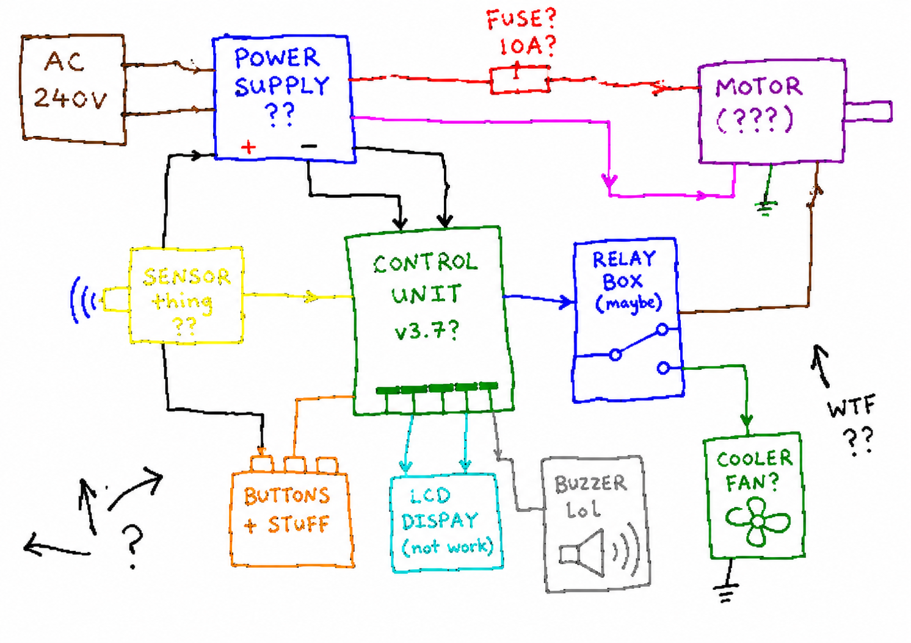

# chatgpt-imagegen

[English](./README.md) | **中文**

**用你的 ChatGPT 订阅生成图片 —— 不需要 `OPENAI_API_KEY`。**

一个零依赖的单文件 Python CLI(同时也是 AI agent skill),直接调用 ChatGPT 内置的 `image_generation` 工具。只要你已经在付 ChatGPT Plus / Pro / Team,你本来就能生图 —— 这个工具只是把这份能力搬到命令行、并暴露给任意 AI agent。

```bash
chatgpt-imagegen "a watercolor cat sitting on a windowsill" -o cat.png
# -> saved: cat.png  (812,344 bytes)  size=1024x1024  quality=medium
```

不用起服务,不用代理,不用 API key。一个 Python 文件,只用标准库。



<sub>出图示例 —— 本工具生成(要求画一张"故意很烂"的老式画图程序原理图)。</sub>

---

## 为什么有这个项目

OpenAI 的图像生成有两条完全独立的路:

| 路径 | 怎么收费 | 怎么用 |
| --- | --- | --- |
| **直连 API**（`/v1/images/generations`） | 按张计费,需要 `OPENAI_API_KEY` | curl / OpenAI SDK 等 |
| **ChatGPT 订阅**（Plus / Pro / Team） | 每月固定费 | ChatGPT 网页/桌面 app,或 Codex CLI 内置的 `image_gen` |

对不用 Codex CLI 的人来说,**订阅这条路是隐形的**。它跑在 ChatGPT 内部的 `backend-api/codex/responses` 接口上(作为 Responses-API 工具),用 `codex login` 写进 `~/.codex/auth.json` 的 OAuth token 鉴权。

`chatgpt-imagegen` 把这份能力搬到命令行、也给任意 AI agent 用 —— 并提供**两个后端**,分别命中你订阅里的不同部分。

## 两个后端

同一份订阅,OpenAI 分了**两个独立的限流桶**;你花哪个桶,取决于图是在**哪儿**生成的:

| 后端 | 怎么生成 | 花哪个桶 | 前置条件 |
| --- | --- | --- | --- |
| **`web`** | 驱动你**已登录的 ChatGPT 浏览器**(经 [`agent-browser-stealth`](https://github.com/leeguooooo/agent-browser-stealth),命令名 `agent-browser`/`abs`),在普通对话里出图 —— 跟你在 app 里打字出图是同一个界面。靠 *stealth* 分支的真 Chrome 连接,过掉 Cloudflare + sentinel 工作量证明(无头/普通客户端过不了)。 | **ChatGPT 对话** —— **不**占用计量的 **Codex 用量**额度。 | 一个登录了 chatgpt.com 的浏览器 + `agent-browser-stealth`。 |
| **`codex`** | 无头 POST 到 `backend-api/codex/responses`,复用 `~/.codex/auth.json`。 | **Codex 用量**(计量的那个桶)。 | `codex login`。 |

**默认 `auto`**:先试 `web`(省 Codex 用量),没有可用登录浏览器时回退 `codex`。用 `--backend web` / `--backend codex` 强制其一(或环境变量 `CHATGPT_IMAGEGEN_BACKEND`)。

- **笔记本/台式机**（Chrome 开着且登录）→ `web` —— 不花 Codex 用量。
- **服务器 / 无头 agent 机器** → `codex` —— 那里没浏览器,`auto` 会自己回退。

`web` 用的是**浏览器当前登录的那个账号**出图,可能和 `~/.codex/auth.json` 不是同一个 —— 让浏览器登录你想用其额度的那个账号。

## 安装

你需要 Python 3.10+、一份 ChatGPT 订阅(Plus / Pro / Team),以及**至少配好一个后端**:

- **默认 `web` 后端:** 装好 [`agent-browser-stealth`](https://github.com/leeguooooo/agent-browser-stealth)(它提供 `agent-browser` / `abs` 命令),并把它的扩展连到一个登录了 chatgpt.com 的 Chrome。必须是 *stealth* 分支 —— 能过 Cloudflare 反爬的就是它。(省你的 Codex 用量额度。)
- **`codex` 后端:** OpenAI Codex CLI(`npm i -g @openai/codex`)并一次性 `codex login`。

`auto` 模式会用其中可用的那个,优先 `web`。两个都配好,就有无缝回退。

#### 配置 `web` 后端(agent-browser-stealth)

**它是什么:** [`agent-browser-stealth`](https://github.com/leeguooooo/agent-browser-stealth) 是 `agent-browser` CLI 的 stealth(反检测)分支。它通过一个浏览器扩展 + 原生消息(native-messaging)中继,驱动你**真实、已登录的 Chrome** —— 于是请求带着真浏览器的 TLS 指纹和 cookie,能过 Cloudflare 反爬 + ChatGPT 的 sentinel 工作量证明。普通无头自动化客户端做不到这点,这就是 `web` 后端必须用 stealth 分支的原因。

- **仓库:** https://github.com/leeguooooo/agent-browser-stealth
- **Chrome 扩展:** [Chrome 应用商店里的 agent-browser-stealth](https://chromewebstore.google.com/detail/agent-browser-stealth/knfcmbamhjmaonkfnjhldjedeobeafmk)

```bash
# 1. 装 CLI(不用 npm、不用 token —— 装上 `agent-browser` / `abs` 命令)
curl -fsSL https://raw.githubusercontent.com/leeguooooo/agent-browser-stealth/main/install.sh | sh

# 2. 注册原生消息宿主
agent-browser extension install

# 3. 给 Chrome 装上扩展(上面的应用商店链接),然后重启 Chrome
# 4. 在那个 Chrome 里登录 https://chatgpt.com
```

扩展连上后,`chatgpt-imagegen`(web 后端)会自动驱动那个真实 Chrome —— 没有远程调试弹窗,也不另起浏览器。

### 方式 A —— 给 AI agent 用(推荐)

经 [skills.sh](https://www.skills.sh) 安装 —— 支持 Claude Code、Codex Agent、Cursor、OpenClaw 等:

```bash
npx skills add leeguooooo/chatgpt-imagegen -g
```

这会把 agent 说明(`SKILL.md`)和 CLI 本体一起放进你 agent 的 skill 目录。然后对任意兼容的 agent 说:*"画一张 xxx"* / *"generate a hero banner for the README"*。

### 方式 B —— 独立 CLI

```bash
git clone https://github.com/leeguooooo/chatgpt-imagegen
cd chatgpt-imagegen
chmod +x chatgpt-imagegen
./chatgpt-imagegen "a tiny pixel-art mushroom"
```

或放到 `$PATH` 上:

```bash
sudo install chatgpt-imagegen /usr/local/bin/chatgpt-imagegen
```

整个安装就这些。不用 `pip install`,不用虚拟环境,不用守护进程。

## 用法

```bash
chatgpt-imagegen "<prompt>" [options]
```

| 参数 | 默认 | 说明 |
| --- | --- | --- |
| `--backend` | `auto` | `auto` \| `web` \| `codex`。`auto` 优先 web(省 Codex 用量),没有登录浏览器时回退 codex。见[两个后端](#两个后端)。也可用 `CHATGPT_IMAGEGEN_BACKEND`。 |
| `--session` | `imagegen-<pid>` | *(web)* 跨次运行复用一个命名的 `agent-browser` Chrome 标签组。 |
| `--keep-tab` | 关 | *(web)* 出图后保留 ChatGPT 标签页(默认关闭它)。 |
| `-o`, `--out PATH` | `assets/generated/<slug>.<ext>` | 输出文件;父目录自动创建。后缀与 `--format` 不一致时会告警(如 `-o foo.jpg --format png`)。 |
| `--size` | `auto` | `auto` 或任意 `WIDTHxHEIGHT`。已验证:`1024x1024`、`1024x1536`、`1536x1024`。更大尺寸原样透传。 |
| `--format` | `png` | `png` \| `jpeg` \| `webp` |
| `--model` | `gpt-5.5` | 承载 `image_generation` 工具的对话模型 |
| `--timeout` | `300` | 整个请求的**总墙钟预算**(秒)。大图/细节图可能 2–3 分钟。 |
| `--stall-timeout` | `120` | 后端静默多少秒判定为**卡死**(早于总预算触发)。会被钳制到 `--timeout`。 |
| `--quiet` | 关 | stdout **只**打印保存路径(适合 agent 管道)。进度仍走 stderr —— 用 `--no-progress` 静音。 |
| `--no-progress` | 关 | 关掉 stderr 的进度时间线(错误仍打印)。 |
| `-V`, `--version` | — | 打印 CLI 版本(`chatgpt-imagegen 0.3.0`)后退出。 |

示例:

```bash
# 默认 → assets/generated/<提示词slug>.png
chatgpt-imagegen "watercolor cat"

# 指定路径
chatgpt-imagegen "logo for a coffee shop, vector style" -o brand/logo.png --size 1024x1024

# 横版 hero banner
chatgpt-imagegen "moody mountain sunset" -o web/hero.png --size 1536x1024

# 在 shell 管道里用
OUT=$(chatgpt-imagegen "icon" --quiet)
echo "saved to $OUT"
```

## AI agent skill

把仓库放进任意 AI agent 的 skill 目录(Claude Code、Codex Agent、Cursor 等):

```bash
# Claude Code 示例
npx skills add leeguooooo/chatgpt-imagegen -g
# 或直接软链进 ~/.claude/skills/
```

随附的 [`SKILL.md`](./SKILL.md) 告诉 agent 何时调用、尺寸配方、存哪儿、怎么处理错误。然后对任意兼容 agent 说:*"画一张 xxx 给我看看"* / *"generate a hero banner for the README"*。

## 能做什么 / 不能做什么

| 参数 | 订阅路径 | 说明 |
| --- | --- | --- |
| `--size` | ✅ 生效 | `auto` 或任意 `WIDTHxHEIGHT`;后端会拒绝它不支持的尺寸。已验证:`auto`、`1024x1024`、`1024x1536`、`1536x1024`。更大尺寸(`2048x*`、`3840x*`)原样透传 —— 后端可能接受也可能拒绝,取决于订阅档位。 |
| `--format` | ✅ 生效 | `png` / `jpeg` / `webp` |
| 质量 | ⚠️ 由模型决定 | 脚本不提供 `--quality`,因为订阅路径不支持可靠的质量控制 —— 后端被观察到会自行选 `low` 或 `medium`,并忽略或降级 `high` 请求。需要显式质量控制就用官方 `/v1/images/generations` API + `OPENAI_API_KEY`。 |
| `background: transparent` | ❌ 订阅路径不支持 | 需要走 API-key 路径 + `gpt-image-1.5` |
| 图像编辑(`/v1/images/edits`) | ❌ 暂未暴露 | 需要的话开 issue |
| 速度 | 通常 15–60 秒,大图/细节图偶尔 2–3 分钟 | 全程流式;每个阶段的时间线打到 stderr,能看到它在干活 |

## 并发

可以同时跑多个 `chatgpt-imagegen` 进程 —— ChatGPT 订阅后端能正常处理并发的 `image_generation` 调用。在 Plus 账号上实测:**4 个并发请求全部 200**,总墙钟 ≈ 最慢的那一个(约 27 秒),无串行、无 429。

```bash
# 从 shell 并发跑 4 个:
for p in apple sky tree sun; do
  chatgpt-imagegen "a tiny $p icon, flat vector, white background" \
    -o "icons/$p.png" --quiet &
done
wait
```

注意:订阅额度和 ChatGPT 网页 app、Codex CLI **共享**。别持续狂跑(>10 张/分钟)—— 早晚会撞每日限流。批量需求请用官方 `/v1/images/generations` API + `OPENAI_API_KEY`。

## 什么时候别用这个 —— 改用 API

只要符合下面任一条,这个工具就不合适:

- 你要**真正的 `quality=high`** 或**原生透明背景** —— 两者都需要官方 `/v1/images/generations` API + `OPENAI_API_KEY`。
- 你在做**面向终端用户的生产服务** —— 用个人 ChatGPT 订阅干这个违反 OpenAI 条款,还会烧掉你日常用 ChatGPT 的额度。
- 你需要**可逐次结算、能转嫁给客户的计费** —— API 有,订阅没有。
- 你要**持续 >10 张/分钟** —— 订阅限流比 API 紧。

这些情况直接打 OpenAI 官方接口:

```bash
curl https://api.openai.com/v1/images/generations \
  -H "Authorization: Bearer $OPENAI_API_KEY" \
  -d '{"model":"gpt-image-2","prompt":"...","size":"1024x1024"}'
```

## 想要一个 OpenAI 兼容的 HTTP API?

如果你需要一个 **HTTP 网关**(让任意 OpenAI SDK / LangChain / OpenWebUI / Dify / 你自己的 app 能 `POST /v1/chat/completions` 拿回图)—— 用姊妹项目:

➡️ **[leeguooooo/agent-cli-to-api](https://github.com/leeguooooo/agent-cli-to-api)** —— 把同一个 ChatGPT 订阅 `image_generation` 工具暴露成 OpenAI 兼容的 `/v1/chat/completions` 服务。需要可网络调用、多客户端、或远程主机使用时选它。

| 你想要 | 用 |
| --- | --- |
| 在自己电脑上跑、偶尔生图、给 agent 用 | **本仓库**(chatgpt-imagegen) |
| 多应用服务器、团队共享、OpenAI-SDK 兼容 | [**agent-cli-to-api**](https://github.com/leeguooooo/agent-cli-to-api) |

## 深入(博客)

关于为什么有这个项目、订阅路径底层怎么跑的长文:

- [技术拆解：把 ChatGPT 订阅转成生图 API（300 行 Python）](https://blog.misonote.com/zh/posts/chatgpt-subscription-image-api/) —— 完整的 OAuth + Responses API + SSE 走读(中文)。
- [可视化速览：一图看懂](https://blog.misonote.com/zh/posts/chatgpt-imagegen-visual-guide/) —— 能力矩阵、流程图、"何时别用"面板(中文)。

英文/日文自动翻译在同一 URL 的 `/en/`、`/ja/` 下。

## 工作原理(技术)

### `web` 后端(默认)

经 `agent-browser-stealth` 驱动你登录的浏览器,让出图跑在消费级 ChatGPT 界面上 —— 无头客户端够不着,因为它挂在 Cloudflare 反爬**和** sentinel 工作量证明后面(`backend-api/sentinel/chat-requirements` + 页面内 `sentinel/sdk.js` 算 token)。真浏览器透明通过两者。流程:

```
chatgpt-imagegen --backend web
   │
   ├── agent-browser open https://chatgpt.com/   (普通对话 —— Temporary Chat 禁用了出图工具)
   ├── 用真实键盘输入打提示词                       (ProseMirror/React 输入框不认纯 DOM 的 `fill`)
   ├── 轮询页面:等流结束 且 新的  资源稳定
   └── 在页面内 fetch 资源字节 (credentials:'include') → base64 → 存盘
       (签名的 estuary/content URL 由浏览器自己的 cookie 授权)
```

token 不出浏览器。每次运行会在你的历史里留一条对话。

### `codex` 后端

Codex CLI 内置的 `image_gen` 能力是一个原生 Responses-API 工具:

```jsonc
// Codex CLI 发往 chatgpt.com/backend-api/codex/responses 的请求:
{
  "model": "gpt-5.5",
  "tools": [{"type": "image_generation"}],
  "input": [{"role": "user", "content": [{"type":"input_text","text":"draw a cat"}]}],
  // ...
}
```

服务器回一条 SSE 流,其 `response.output_item.done` 事件携带 `item.type === "image_generation_call"` 负载,其中 `item.result` 是 base64 PNG。`chatgpt-imagegen` 就是这么做的:

```
chatgpt-imagegen
   │
   ├── 读 ~/.codex/auth.json     (OAuth access_token、account_id、refresh_token)
   ├── 读 ~/.codex/version.json  (codex CLI 版本 → 匹配服务器预期;取不低于已知下限)
   │
   └── POST https://chatgpt.com/backend-api/codex/responses
       headers: Authorization、version、originator、session_id 等
       body:    tools: [image_generation]
       │
       └── SSE 流
           ├── response.image_generation_call.in_progress    → "queued"
           ├── response.image_generation_call.generating      → "generating"
           ├── response.image_generation_call.partial_image   → "receiving image (partial N)"
           ├── response.output_item.done  ← item.result = base64 PNG
           └── response.completed
```

OAuth token 过期时,脚本会经 `https://auth.openai.com/oauth/token`(用 `codex login` 已存的 refresh_token)自动刷新,并把新 token 写回 `~/.codex/auth.json`。

## 许可证

MIT —— 见 [LICENSE](./LICENSE)。

## 免责声明

本工具调用的是 ChatGPT 内部的 `backend-api/codex` 接口,也就是官方 Codex CLI 用的同一个接口。它不是有文档的公开 API,OpenAI 随时可能更改或限制。使用风险自负,且须遵守 [OpenAI 使用条款](https://openai.com/policies/row-terms-of-use/) —— 尤其**不要用你的 ChatGPT 订阅去支撑对外公开的图像生成服务**。
